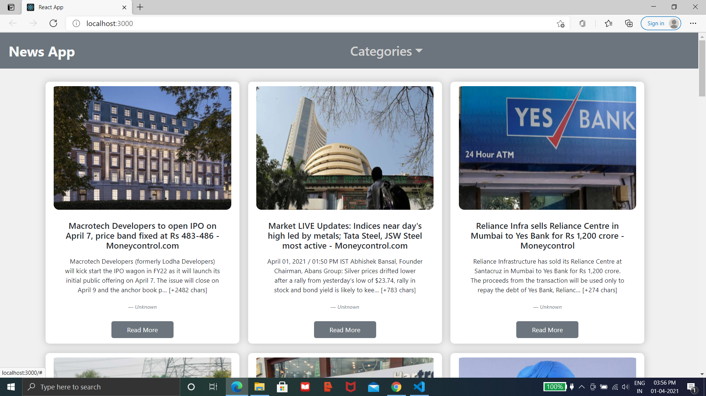

# News-App
Created using [News API] (https://newsapi.org/)
[Live Demo](https://pratikpz18.github.io/newsapp/) its not rendering news because newsapi dont allow i guess.
# Setup:
* Run `npm install` for installing all dependencies
* Go to [News API] (https://newsapi.org/) signin for Api Key
* Add that Api key in API_KEY inside NewsContainer folder
* `npm start` to run appliction ans visit http://localhost:3000/

## ScreenShots :
- Default

- Selecting Category

- Responsive

# Features:
----
* Select Particular Category Accordingly News For that will be displayed.
* For Full Article click Read More
* Responsive
